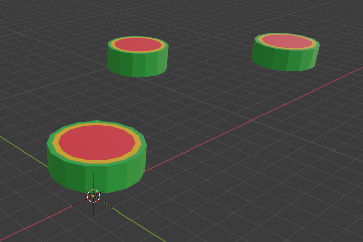
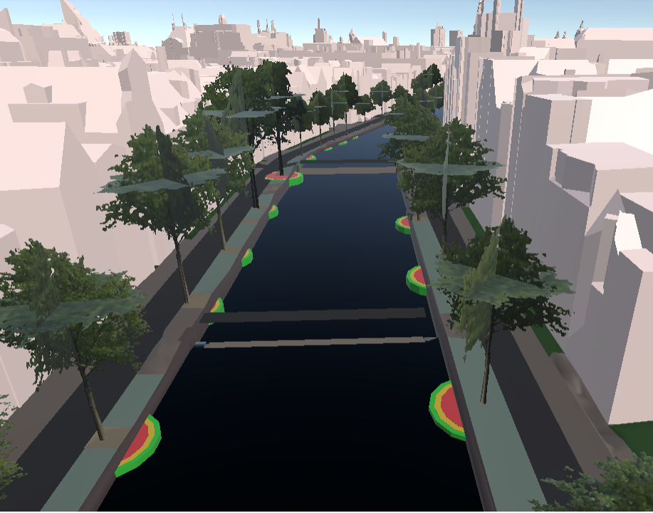
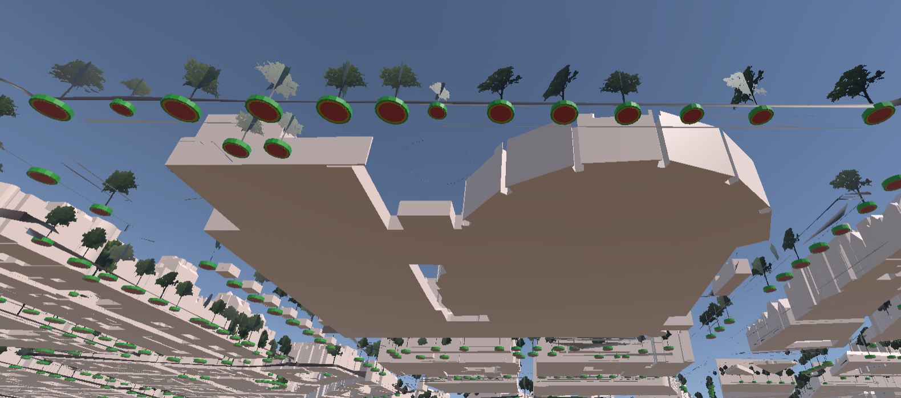
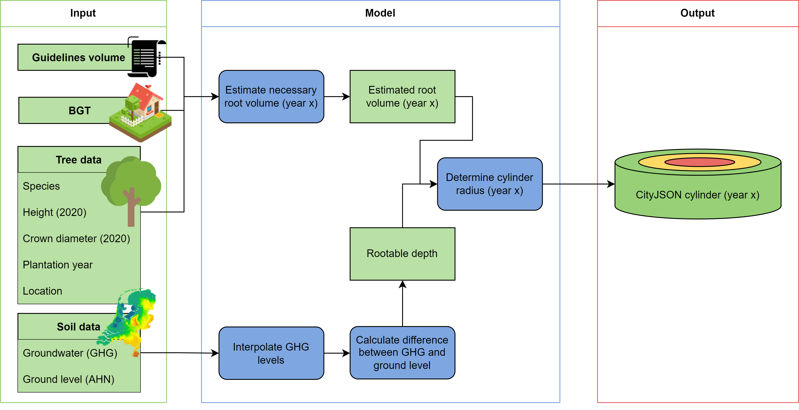
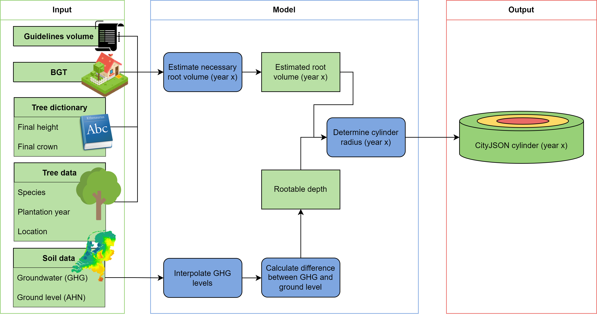
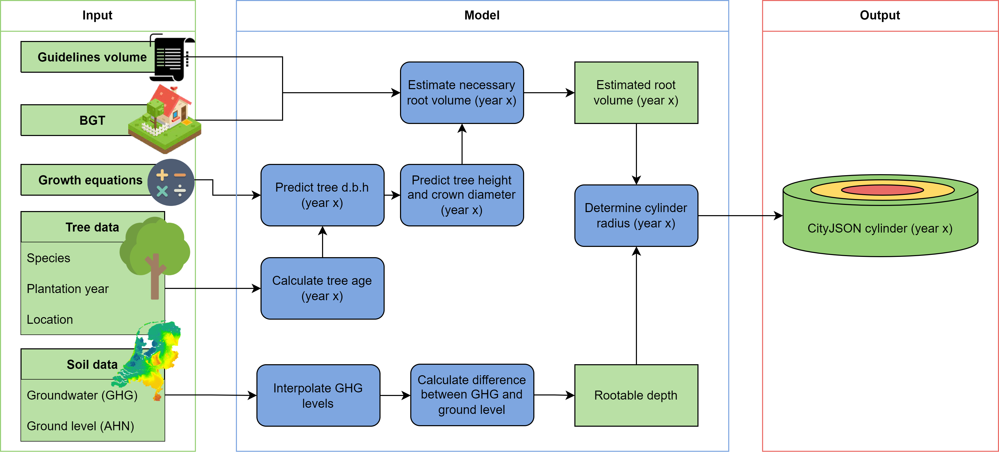

# Tree Root Model 

A model for estimating the necessary root volume for tree roots, now and in the future. The estimation is based on the observable tree parameters and the estimated volume is converted to a cylindrical geometry. These cylinders consist of three different layers, which correspond to the different ambition levels (marginal, reasonable, optimal) following the root volume guidelines from [Norminstituut Bomen](https://www.norminstituutbomen.nl/).

#### Images:
* Top left: An example of how the estimated root volume cylinders look in [Blender](https://www.blender.org/).
* Top right: A top-down view of 3D Amsterdam with the root volume cylinders included.
* Bottom: A bottom-up view of 3D Amsterdam with the root volume cylinders included. 

  
 


## About the Project
This project is an internship thesis for the Master Computational Science at the University of Amsterdam. It was created in the [3D Amsterdam](https://3d.amsterdam.nl/) team and the results are included there (TODO is dat uiteindelijk wel zo?). 

We developed three different methods: the static, tree dictionary, and tree growth method. For more information about the methods, see How it Works. For the thesis, the different methods were first tested and validated on three different subregions in Amsterdam: het Wallengebied, IJburg, and Sarphatipark. Based on these experiments, the tree dictionary method was used to run the model for the tree datasets of the whole city of Amsterdam. 

The model needs at least some input about the tree, depending on which of the three methods a user wants to use (see Usage). The model also needs information about the BGT and maaiveld (AHN) at the location of the input trees. If this is not known by the user, the model requests them via URL. Lastly, the model needs a mesh of Gemiddeld Hoogste Grondwaterstand (GHG, average highest groundwater level) measurements (see Usage). 

The main function in the model outputs NumPy arrays. With another script in the model, they can be converted to [CityJSON](https://www.cityjson.org/) files. For including the root volume cylinders in 3D Amsterdam, they had to be converted to binary format using the [Tile Bake Tool](https://github.com/Amsterdam/CityDataToBinaryModel) developed by the 3D Amsterdam team. 


### Built with
* [Pandas](https://pandas.pydata.org/docs/index.html)
* [NumPy](https://numpy.org/)
* [Math](https://docs.python.org/3/library/math.html#module-math)
* [Os](https://docs.python.org/3/library/os.html#module-os)
* [Json](https://docs.python.org/3/library/json.html#module-json)
* [Vedo](https://vedo.embl.es/)
* [Urllib](https://docs.python.org/3/library/urllib.html#module-urllib)
* [Copy](https://docs.python.org/3/library/copy.html)
* [Matplotlib](https://matplotlib.org/) 
* [Rijksdriehoek](https://pypi.org/project/rijksdriehoek/) 
* [PyShp](https://pypi.org/project/pyshp/)
* [BS4](https://www.crummy.com/software/BeautifulSoup/bs4/doc/)

---
## Project Structure 
There are the following folders in the structure:
1) [`data`](./data): Contains files with the tree information that was used in the project, the root volume numbers from Boommonitor, and the growth equations from the Urban Tree Database. 
2) [`grondwater`](./grondwater): Contains the groundwater data CSVs from Waternet for the subregions used in this project (downloaded in March 2022), some NumPy and Dataframe files containing GHG values of the subregions (from January-May 2022), and the mesh of GHG values for Amsterdam (one with holes and one filled, created in May 2022). 
3) [`output`](./output): Contains the CityJSON files for the different subregions, methods and years, and the numpy files for the subregions and the whole city. 
4) [`output_bin`](./output_bin): Contains the binary and gltf tiles of subregion het Wallengebied. 
5) [`plots`](./plots): Contains the figures resulting from the validation and that are included in the report. 
6) [`validation`](./validation): Contains the code used for the validation. This is only functioning as example since most validation data is not publicly available, like the road damage reports and ground radar scans, so it is impossible to rerun most code for other users. 

These are the most important scripts for using the model:
1) [`main_code.py`](./main_code.py): For running the model, takes the input parameters and estimates the corresponding necessary root volume in NumPy arrays. 
2) [`data_to_cityjson.py`](./data_to_cityjson.py): For converting the NumPy arrays to CityJSON geometry.
3) [`GHG_calculator.py`](./GHG_calculator.py): For calculating the GHG values from the Waternet groundwater measurement CSVs. 
4) [`interpolation.py`](./interpolation.py): For interpolating the GHG values to a mesh. 

The other scripts and files are: 
1) [`ahn_reader.py`](./ahn_reader.py): For making URL requests for the AHN and RIVM data, which determine the tree height when unknown and the ground level height. 
2) [`bgt_reader.py`](./bgt_reader.py): For making URL requests to the BGT values. It also contains code for classifying the returned BGT value as a corresponding soil profile type. 
3) [`boommonitor_calc.py`](./boommonitor_calc.py`): Calculates the initial root volume numbers and growth per year numbers using the boommonitor info in the data folder. 
4) [`city_to_binary.py`](./city_to_binary.py): For converting the CityJSON files to binary. This needs the [Tile Bake Tool](https://github.com/Amsterdam/CityDataToBinaryModel) developed by the 3D Amsterdam team. 
5) [`cityjson_converter.py`](./cityjson_converter.py): Contains the functionality for converting the NumPy arrays to CityJSONs.
6) [`method_static.py`](./method_static.py), [`method_treedict.py`](./method_treedict.py), and [`method_treegrowth.py`](./method_treegrowth.py): Contain the code for respectively the static, tree dictionary and tree growth methods. 
7) [`rootvolume.py`](./rootvolume.py): For classifying height and crown sizes and determining the root volume. 
8) [`select_climate.py`](./select_climate.py): For selecting a climate region in the tree growth equation database in the data folder. The project used the Pacific Northwest. 
9) [`select_trees.py`](./select_trees.py): Used to select trees for the different subregions out of the total Amsterdam tree data. Can probably be done faster using for example [QGIS](https://qgis.org/nl/site/) if the user knows to use that. 
10) [`timedependency.py`](./timedependency.py): Contains the allometric growth equations and functions that use them for predictions about the height and crown size of the trees. 
11) [`treedict.py`](./treedict.py): Contains the tree dictionary used in the tree dictionary method, as well as a list of fast growing tree genera. 
12) [`root_config.json`](./root_config.json): Configuration file that was created for using the [Tile Bake Tool](https://github.com/Amsterdam/CityDataToBinaryModel).

---
## Installation 
1) Make sure to have Python version 3.8.5 installed on your machine. This project used [Anaconda](https://www.anaconda.com/), which comes with Python and a lot of nice libraries, as well as a terminal.

2) Clone this repository using the terminal:
    ```bash
    git clone https://github.com/reitsmairis/tree_root_model
    ```
3) Install all dependencies listed above: 
    ```bash
    pip install -r requirements.txt
    ```
---
## Usage
### Necessary input
The file [`data/template.csv`](./data/template.csv) is a template for the input parameters related to the tree. This is a CSV separated by ';', just like the CSVs for the trees that the city of Amsterdam uses (TODO daarheen verwijzen). The template adapted the same column headers as those CSV files. The template contains additional columns as well: 'Boomkroon', 'RD_X', 'RD_Y', 'BGT_class', 'maaiveld', and 'GHG'. If the user knows these values, they should be filled in. If the values are unknown for all trees, these columns should be deleted such that they can be created and filled in by the model. The list below explains what to fill in for a specific tree, this is adapted from the city of Amsterdam CSV files, so running the model with these files should work instantly.

* OBJECTNUMMER: object number, is used for giving the root volume cylinder an ID if Boomnummer is unknown ('Onbekend')
* Boomnummer: tree number, is used for giving the root volume cylinder an ID. Fill in 'Onbekend' when unknown. 
* Soortnaam_WTS: scientific species name, determines the species of the tree. Fill in 'Onbekend' when unknown. 
* Boomtype: tree type, determines the tree type (e.g., shape or pollard tree). Fill in 'Onbekend' when unkown. 
* Boomhoogte: tree height, can be a float, int or string range (e.g, '15 tot 18 m' or 12.2). Fill in 'Onbekend' when unkown.
* Boomkroon: crown diameter, can be a float or int. Fill in 'Onbekend' when unkown.
* Plantjaar: year of plantation. Fill in 0 when unkown.
* LNG: longitude of tree position in WGS84 coordinates.
* LAT: latitude of tree position in WGS84 coordinates. 
* RD_X: x-coordinate of tree position in RD.
* RD_Y: y-coordinate of tree position in RD. 
* BGT_CLASS: soil profile type at tree location, should be left empty when unknown.
* maaiveld: ground level height (AHN) at tree location (WRT NAP), should be left empty when unknown.
* GHG: average heighest groundwater level at tree location (WRT NAP), should be left empty when unknown.

The following input is required (or optional) when using the three different methods:

* Static method: 
    * Boomhoogte
    * Boomkroon
    * Soortnaam_WTS (optional, assume regular growing tree if unknown)
* Tree dictionary method:
    *  Soortnaam_WTS
    *  Tree dictionary: [`treedict.py`](./treedict.py)
*  Tree growth method:
    * Soortnaam_WTS
    * Growth equations from the Urban Tree Database: [`data/RDS-2016-0005`](./data/RDS-2016-0005) 
* For alle three methods:
    * Plantjaar
    * either Boomnummer or OBJECTNUMMER
    * either LNG and LAT or RD_X and RD_Y
    * Boomtype (optional, assume regular tree if unknown)
    * BGT_CLASS (optional, can be requested via URL if unknown)
    * maaiveld (AHN ground level) value (optional, can be requested via URL if unknown)
    * GHG (average highest groundwater level) value (see explanation below)
    
#### Concerning the GHG (average highest groundwater level): 
[`Filled_Amsterdam_mesh.vtk`](./grondwater/Filled_Amsterdam_mesh.vtk) is a mesh of the GHG values in Amsterdam that the model reads out at the location of an input tree. If a user wants to use the model for a different city than Amsterdam or with a more recent mesh, the following steps should be taken to create a new mesh:
1) Create a NumPy array containing three-dimensional coordinates: (x, y, GHG). Here x and y are the locations of the GHG measurements, and GHG is the value of the measurement (WRT NAP). We created such an array from the groundwater files from Waternet, which can be downloaded [here](https://maps.amsterdam.nl/open_geodata/). The code that creates an array from the CSVs is [`GHG_calculator`](./GHG_calculator.py). A user can change the ‘path’ in this script to the folder path containing their Waternet files, and change the output name and location of the NumPy array. The script is then ready to run:
    ```bash
    python GHG_calculator.py
    ```
2. Create a mesh of the GHG values. The GHG values from before are point data. They should be interpolated to a mesh. This can be done with the code [`interpolation.py`](./interpolation.py), in which a user should change the filepath for the input NumPy array GHG points from step 1 and a location for the mesh to be stored. The script is then ready to run:
3. 
    ```bash
    python interpolation.py
    ```
    
### Running the main code
When a user has assembled the necessary input data, they are almost ready to run the model using the main script [`main_code.py`](./main_code.py). In the lowest part of this script, a user can change the following parameters:
* model: To pick the method that should be used: the options are 'static' (static method), 'treedict' (tree dictionary method), and 'treegrowth' (tree growth method). 
* area: Solely used for naming the output files and folders.
* df: Adjust the filepath for the location and name of your tree CSV.
* mesh: Adjust the filepath to your GHG mesh.
* years: Choose the years for which you want to estimate the root volumes.

The model is then ready to run: 
```bash
python main_code.py
```
    
Running the above stores the data that is necessary for the rootvolume as NumPy arrays in the numpy_files folder. The ground level, GHG, x,y and tree number are stored in single arrays. The values that change over time, which are the radius and the volume, are stored in an array of arrays, corresponding to the different years. Furthermore, the radius and volume numbers are threefold: they contain three values corresponding to the three different ambition levels. These values are backed up every 100 trees for if something goes wrong. In the end, the ground level (AHN), soil profile type (BGT) and GHG values are appended to the input tree CSV if they were not provided (a new CSV is created with the same name as the input CSV but with 'filled' as extension), to make future runs faster. If a user does not want to use this data for future runs, they can delete the CSV columns again. 

### NumPy arrays to CityJSON
If everything went well in the previous steps, an output folder for the CityJSON files is created containing the folder with the name that you picked for 'area'. The data from the run that we just did however, is still only available in the numpy_files folder in NumPy array format. With the [`data_to_cityjson.py`](./data_to_cityjson.py) script, the NumPy arrays that the main code outputs can be converted to cityjson files. The upper part of this script contains some parameters that a user could change:
* years: The years for which rootvolumes are estimated.
* vertices: The amount of vertices that you want your cylinders to have. This should be an even number of at least 8. 
* model: The used method, or the method for which you want CityJSON cylinders
* ?Subareas: if you divided the output in different subregions, if not just choose the name that you used for the full area
* ?Main_area: TODO

The script is then ready to run: 
```bash
python data_to_cityjson.py
```

If everything went well, this created CityJSON files in the output folder with the name that you picked for 'area'. 

### CityJSON to binary
The previous step converted the estimated root volumes to CityJSON format. In order to include the CityJSONs in Unity projects like 3D Amsterdam, they should be converted to binary format. If one wants to have binary tiles of the estimated cylinders, they should follow these steps: 
1) Install the [Tile Bake Tool](https://github.com/Amsterdam/CityDataToBinaryModel) following the instructions. 
2) Change the models, years, areas and levels parameters in the [`city_to_binary.py`](./city_to_binary.py) script. Besides, the last line of this script should be changed to the location of where the tilebaketool is stored. Also the 'config[‘sourceFolder’]' and 'config[‘outputFolder’]' paths to resp. where the cityjson output is stored and where the binary data should be stored. 
3) Run the script:
    ```bash
    python city_to_binary.py
    ```

---

## How it Works
The model consists of three different methods that vary sligthly in input parameters (see Usage). This section shows the pipeline diagrams corresponding to the different methods. 

#### The static method
The first method is the static method. This method uses the height and crown information of a tree to estimate the root volume. For the project, we had access to height and crown information from 2020. The static method estimates the future root volumes based on these values as well.

<figure>

</figure>

#### The tree dictionary method
The second method is the tree dictionary method. This method uses the height and crown information from the tree dictionary, which contains the height and crown information for a fully mature tree, based on their species. The tree dictionary contains this information for the 15 most occuring tree genera in Amsterdam. 

<figure>

</figure>


#### The tree growth method
The third method is the tree growth method. This method uses the equations from the Urban Tree Database to predict the height and crown size for a specific year based on the age of a tree. These equations are species-dependent, and are created for the most occuring tree genera in the US. 

<figure>

</figure>

#### Volume to cylinders
The three methods convert the input parameters to an estimated root volume. This estimated root volume needs to be converted to a cylinder. The height of this cylinder is determined by the difference between the ground level and the average highest groundwater level (GHG). With the height and the volume, the cylinder radius can also be determined. 

#### Want to know more?
The project structure section lists the model scripts and a short description. For a more elaborate explanantion of how the model works see (TODO linkje naar mn report). This report also contains the validation experiments, comparison between the methods, and the conclusions of the thesis project. 

---
## License
TODO 

---


## Contact

Iris Reitsma - reitsmairis@gmail.com 

LinkedIn: https://www.linkedin.com/in/iris-reitsma-269209139/ 

Project link: https://github.com/reitsmairis/tree_root_model 

---

## Acknowledgements 

#### Input data: 
* The files in data/boommonitor_data contain root volume numbers from the calculation tool [Boommonitor](https://www.norminstituutbomen.nl/instrumenten/boommonitor/) from [Norminstituut Bomen](https://www.norminstituutbomen.nl/). These numbers can be accessed with a license. These guideline numbers are used to estimate the root volume for a tree with specific input parameters. 
* The file data/Cobra.data.csv contains the crown areas and diameters and other information about trees in three subregions of Amsterdam (Wallengebied, Sarphatipark, IJburg). This data is delivered by [Cobra Groeninzicht](https://www.cobra-groeninzicht.nl/). The data was used as input for the static method and to validate the crown predictions of the tree dictionary method. 
* The other tree data is from the city of Amsterdam and publicly available [here](https://maps.amsterdam.nl/open_geodata/). 
* The growth equation information in [`data/RDS-2016-0005`](./data/RDS-2016-0005) data/RDS-2016-0005 is from the [Urban Tree Database](https://www.fs.usda.gov/rds/archive/Catalog/RDS-2016-0005) and was made available by the [Forest Service U.S. Department of Agriculture](https://www.fs.usda.gov/treesearch/pubs/52933).
* The groundwater level measurements are done by Waternet and can be downloaded [here](https://maps.waternet.nl/kaarten/peilbuizen.html). 

#### Validation data: 
* [Terra Nostra](https://www.terranostra.nu/nl) delivered the ground radar data and the report of their investigation. 
* The department of municipal management ('afdeling stedelijk beheer') of the city of Amsterdam provided road inspection data ('inspectiegegevens') concerning root lifting. 
* The citizen reports about root lifting were made available by the [Signalen Informatievoorziening Amsterdam](https://openresearch.amsterdam/nl/page/39785/de-signalen-informatievoorziening-amsterdam-sia). 

#### Other: 
* The tool for converting the CityJSON files to binary format (Tile Bake Tool) is developed by the 3D Amsterdam team and available [here](https://github.com/Amsterdam/CityDataToBinaryModel). 
